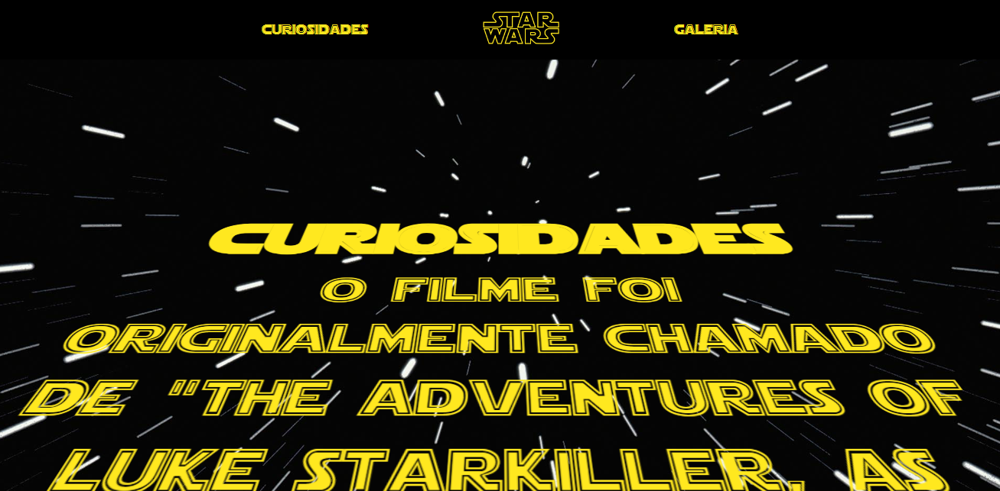
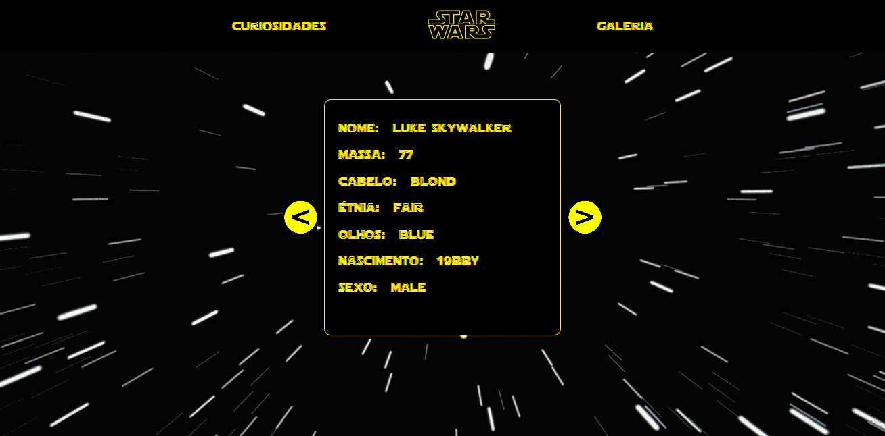

<h1> # workshop-frontend-2023.2 </h1>

<h2>Projeto Star Wars</h2>

<h3> Descrição  </h3>

Desafio dado pela fabrica de software.

Projeto Finalizado

  ## REGRAS:

1. O imersionista deve realizar o seu próprio código e poderá, caso seja necessário, basear-se em vídeos no Youtube e em documentações (obs.: basear-se não é copiar o código);
2. Caso haja convergência entre layout e/ou códigos entre os imersionistas, poderá ocasionar na sua eliminação;
3. O uso do ReactJS é opcional. O imersionista é livre para utilizar qualquer biblioteca.
4. Ao final, o imersionista deverá criar um repositório no github com o seguinte nome: workshop-frontend-2023.2. Após isso, commitar o código e compartilhar o repositório nesse link: https://forms.gle/Wvq7N4Fqa6usFNM18
5. É recomendável que o arquivo README seja criado e mantido atualizado, pois ele é um requisito obrigatório para garantir a compreensão e acessibilidade do projeto.
6. O imersionista poderá fazer o deploy do site com o Vercel, ou qualquer outra plataforma.
7. Por fim, atente-se à organização: o uso de boas práticas, organização entre pastas e componentes e a refatoração do código é de extrema importância, visto que o seu código será avaliado. Logo, focar nesses pontos fará com que você tenha uma boa impressão.

<h2>Segue abaixo a tela Incial:</h2>

<h2>Segue abaixo a tela do Card:</h2>

